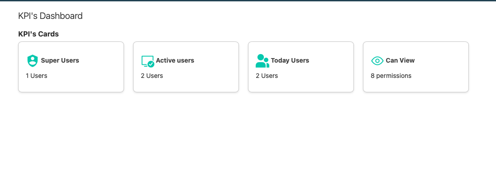

# django_kpi

`django_kpi` is a Django package designed to create flexible Key Performance Indicators (KPIs) for your projects. This package allows you to define, track, and manage KPIs with ease.

## Features

- Define custom KPIs
- Track KPI performance over time (WIP)
- Flexible configuration options
- Easy integration with existing Django projects

## Installation

To install `django_kpi`, use pip:

```bash
pip install django_kpi
```

## Usage

1. Add `django_kpi` to your `INSTALLED_APPS` in your Django settings:

    ```python
    INSTALLED_APPS = [
        ...
        'django_kpi',
    ]
    ```

2. Update your `urls.py` to include the `django_kpi` URLs:

    ```python
    from django.urls import path, include

    urlpatterns = [
        ...
        path('kpi/', include('django_kpi.urls')),
    ]
    ```

3. Run the migrations to create the necessary database tables:

    ```bash
    python manage.py migrate
    ```

4. Define your KPIs in the Django admin interface or through the provided API.

## Screenshots

### Input


### Output



## Contributing

Contributions are welcome! Please submit a pull request or open an issue to discuss your ideas.

## License

This project is licensed under the MIT License. See the [LICENSE](LICENSE) file for details.

## Contact

For questions or support, please contact [mchahboun@majaracapital.com](mailto:mchahboun@majaracapital.com).
